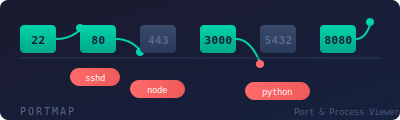

# portmap

<!-- Header SVG: assets/header.svg -->

<p align="center">
  
</p>

<!-- Badges -->
<p align="center">


</p>

---

**portmap** は统一的·クロスプラットフォーム対応ポート·プロセスビューア。
`lsof -i`（macOS）、`netstat -tlnp`（Linux）、`netstat -ano`（Windows）を覚える必要なし。
1つのCLIでどこでも動作します。

## 機能

- **クロスプラットフォーム** -- macOS、Linux、Windows で動作
- **Richターミナル出力** -- ソート可能なカラー付きテーブル
- **監視モード** -- リアルタイムでポート変更を監視、アラート通知
- **構造化エクスポート** -- スクリプト用途のJSON/CSV出力
- **stdlib + psutil以外不要** -- 軽量で高速

## インストール

### pipから

```bash
pip install portmap
```

### Homebrewから

```bash
brew install portmap
```

### ソースから

```bash
git clone https://github.com/izag8216/portmap.git
cd portmap
pip install -e .
```

## クイックスタート

### 全リスニングポートを一覧表示

```bash
portmap list
```

### 特定のポートを検索

```bash
portmap find 8080
portmap find 3000 --verbose
```

### ポート変更を監視

```bash
portmap watch --interval 2 --alert-on-change
```

### JSON/CSVにエクスポート

```bash
portmap export --format json --output ports.json
portmap export --format csv --output ports.csv
```

## 使用方法

```
portmap list [--sort-by {port|pid|process}] [--protocol {tcp|udp|both}]
portmap find <PORT> [--verbose]
portmap watch [--interval SECONDS] [--alert-on-change]
portmap export [--format {json|csv}] [--output FILE]
```

## ライセンス

MIT License - 詳細は [LICENSE](LICENSE) を参照してください。